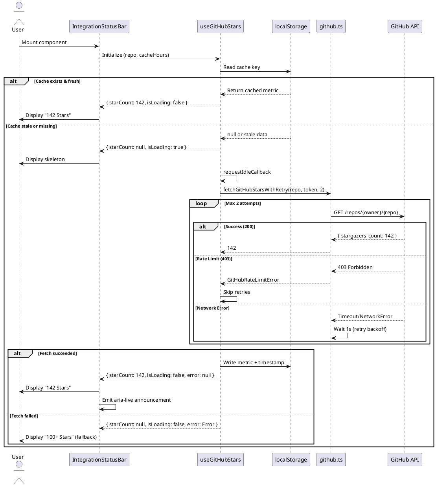

# GitHub Star Fetch API Contract

**Version:** 1.0
**Last Updated:** 2025-11-22
**Iteration:** I2.T3

---

## Overview

This document specifies the contract for fetching GitHub repository star counts in the CodeMachine website. The integration provides live telemetry badges while maintaining resilience through caching, retries, and fallback mechanisms.

**Key Design Principles:**
- Non-blocking: Fetches occur via `requestIdleCallback` to avoid blocking main thread
- Resilient: Multi-layered fallback (cache → retry → hardcoded fallback)
- Performant: 6-hour cache TTL minimizes API calls
- Accessible: `aria-live` announcements for screen readers

---

## API Endpoint

### GitHub REST API v3 - Repository Endpoint

```
GET https://api.github.com/repos/{owner}/{repo}
```

**Example:**
```
GET https://api.github.com/repos/moazbuilds/CodeMachine-CLI
```

### Request Headers

| Header | Value | Required | Description |
|--------|-------|----------|-------------|
| `Accept` | `application/vnd.github+json` | Yes | GitHub API media type |
| `X-GitHub-Api-Version` | `2022-11-28` | Yes | API version identifier |
| `Authorization` | `Bearer {token}` | No | Optional authentication (increases rate limit) |

**Authentication Note:**
- Unauthenticated: 60 requests/hour per IP
- Authenticated: 5,000 requests/hour per user
- Token sourced from `VITE_GITHUB_TOKEN` environment variable
- Token is **never** persisted in cache or logs

### Request Example (curl)

**Unauthenticated:**
```bash
curl -H "Accept: application/vnd.github+json" \
     -H "X-GitHub-Api-Version: 2022-11-28" \
     https://api.github.com/repos/moazbuilds/CodeMachine-CLI
```

**Authenticated:**
```bash
curl -H "Accept: application/vnd.github+json" \
     -H "X-GitHub-Api-Version: 2022-11-28" \
     -H "Authorization: Bearer YOUR_GITHUB_TOKEN" \
     https://api.github.com/repos/moazbuilds/CodeMachine-CLI
```

---

## Response Schema

### Success Response (200 OK)

```json
{
  "id": 123456789,
  "name": "CodeMachine-CLI",
  "full_name": "moazbuilds/CodeMachine-CLI",
  "stargazers_count": 142,
  "watchers_count": 142,
  "forks_count": 8,
  ...
}
```

**Extracted Field:**
- `stargazers_count` (number): Current star count for the repository

### Rate Limit Response (403 Forbidden)

```json
{
  "message": "API rate limit exceeded for {ip}",
  "documentation_url": "https://docs.github.com/rest/overview/resources-in-the-rest-api#rate-limiting"
}
```

**Response Headers:**
- `X-RateLimit-Remaining`: Number of requests remaining (0 when limited)
- `X-RateLimit-Reset`: Unix timestamp when limit resets

### Error Responses

| Status Code | Meaning | Action |
|-------------|---------|--------|
| 200 | Success | Parse `stargazers_count` |
| 403 | Rate limit exceeded | Skip retries, use fallback immediately |
| 404 | Repository not found | Log error, use fallback |
| 500-599 | Server error | Retry once, then use fallback |
| Network error | Offline/timeout | Retry once, then use fallback |

---

## Caching Strategy

### Cache Key Format

```
codemachine:metric:github-stars:{owner}/{repo}
```

**Example:**
```
codemachine:metric:github-stars:moazbuilds/CodeMachine-CLI
```

### Cached Data Structure

```typescript
interface CachedStarMetric {
  label: string        // Repository identifier (e.g., "moazbuilds/CodeMachine-CLI")
  count: number        // Star count (e.g., 142)
  timestamp: number    // Unix timestamp in milliseconds
  fallbackCopy: string // Display text (e.g., "100+ Stars")
}
```

**Example:**
```json
{
  "label": "moazbuilds/CodeMachine-CLI",
  "count": 142,
  "timestamp": 1700654321000,
  "fallbackCopy": "100+ Stars"
}
```

### Cache Time-To-Live (TTL)

- **Default:** 6 hours (21,600,000 ms)
- **Override:** Pass `cacheHours` prop to `IntegrationStatusBar` or `useGitHubStars`
- **Environment Override:** Set `VITE_GITHUB_STARS_TTL_HOURS` (positive number) to change the default TTL without touching code

**TTL Calculation:**
```typescript
const isCacheStale = (cached: CachedStarMetric, ttlHours: number): boolean => {
  const now = Date.now()
  const age = now - cached.timestamp
  const ttlMs = ttlHours * 60 * 60 * 1000
  return age >= ttlMs
}
```

### Cache Behavior

1. **Cache Hit (Fresh):** Display cached value immediately, no fetch
2. **Cache Hit (Stale):** Display cached value, fetch in background to refresh
3. **Cache Miss:** Show loading skeleton, fetch immediately
4. **Cache Write Failure:** Log warning, continue with in-memory value

---

## Retry & Timeout Policy

### Timeout

- **Duration:** 10 seconds per request
- **Implementation:** `AbortController` with `setTimeout`
- **Behavior:** Throws `GitHubRequestTimeoutError` on timeout

### Retry Logic

- **Max Attempts:** 2 (1 initial + 1 retry)
- **Backoff:** Linear (1s delay after first failure, 2s after second)
- **No Retry Conditions:**
  - `403` (rate limit) → immediate fallback
  - Component unmounted → abort in-flight requests

### Retry Flowchart

```
┌─────────────┐
│ Attempt 1   │
└──────┬──────┘
       │
   ┌───▼────┐
   │Success?│──Yes──► Return star count
   └───┬────┘
       │ No
   ┌───▼──────┐
   │Rate Limit│──Yes──► Skip retry, use fallback
   │(403)?    │
   └───┬──────┘
       │ No
   ┌───▼──────────┐
   │Wait 1s       │
   └───┬──────────┘
       │
   ┌───▼────┐
   │Attempt 2│
   └───┬────┘
       │
   ┌───▼────┐
   │Success?│──Yes──► Return star count
   └───┬────┘
       │ No
   ┌───▼──────┐
   │Use       │
   │Fallback  │
   └──────────┘
```

---

## Fallback Copy Strategy

### Fallback Scenarios

| Scenario | Fallback Text | Source |
|----------|---------------|--------|
| Rate limit (403) | `"100+ Stars"` | `buildFallbackStarCopy()` |
| Network error | `"100+ Stars"` | `buildFallbackStarCopy()` |
| Timeout (10s+) | `"100+ Stars"` | `buildFallbackStarCopy()` |
| Feature disabled | `"100+ Stars"` | Custom fallback prop or default |

### Fallback Helper Function

```typescript
/**
 * Located in: src/content/links.ts
 */
export function buildFallbackStarCopy(repoName: string): string {
  void repoName
  return '100+ Stars'
}
```

**Usage:**
```typescript
const fallback = buildFallbackStarCopy('CodeMachine-CLI')
// Result: "100+ Stars"
```

**Component Override:**
```tsx
<IntegrationStatusBar fallbackLabel="100+ Stars" />
```

---

## Instrumentation & Logging

### Console Events

All logs use structured format: `[Context] Message`

#### Success Events

```javascript
console.info('[GitHub API] Fetching stars for moazbuilds/CodeMachine-CLI')
console.info('[GitHub API] Using authenticated request')
console.info('[GitHub API] Successfully fetched 142 stars for moazbuilds/CodeMachine-CLI')
console.info('[useGitHubStars] Successfully fetched and cached 142 stars')
console.info('[IntegrationStatusBar] Metric updated:', { label, count, timestamp, fallbackCopy })
```

#### Warning Events

```javascript
console.warn('[GitHub API] Rate limit exceeded. Remaining: 0, Reset: 2025-11-22T15:30:00.000Z')
console.warn('[GitHub API] Request failed with status 404')
console.warn('[GitHub API] Request timed out after 10000ms')
console.warn('[GitHub API] Network error:', error)
console.warn('[useGitHubStars] Failed to write cache:', error)
```

### Future Analytics Integration

When `src/lib/analytics.ts` is implemented (I2.T4), emit these events:

```typescript
trackEvent('github_stars_fetched', {
  repo: string,
  count: number,
  cached: boolean,
  duration_ms: number
})

trackEvent('github_stars_error', {
  repo: string,
  error_type: 'rate_limit' | 'timeout' | 'network' | 'unknown',
  used_fallback: boolean
})

trackEvent('github_stars_cache_hit', {
  repo: string,
  is_stale: boolean
})
```

---

## Integration Points

### Component: IntegrationStatusBar

**Location:** `src/components/IntegrationStatusBar/index.tsx`

**Props:**
```typescript
interface IntegrationStatusBarProps {
  repo?: string          // Default: "moazbuilds/CodeMachine-CLI"
  fallbackLabel?: string // Default: "100+ Stars"
  cacheHours?: number    // Default: VITE_GITHUB_STARS_TTL_HOURS or 6
  className?: string     // Additional CSS classes
}
```

**Usage:**
```tsx
import { IntegrationStatusBar } from '@/components/IntegrationStatusBar'

// Basic usage
<IntegrationStatusBar />

// Custom repository
<IntegrationStatusBar repo="facebook/react" />

// Custom fallback and cache
<IntegrationStatusBar
  fallbackLabel="⭐ Popular"
  cacheHours={12}
/>
```

### Hook: useGitHubStars

**Location:** `src/hooks/useGitHubStars.ts`

**Options:**
```typescript
interface UseGitHubStarsOptions {
  repo: string
  cacheHours?: number // Default: VITE_GITHUB_STARS_TTL_HOURS or 6
  onMetricUpdate?: (metric: CachedStarMetric) => void
  enabled?: boolean
}
```

**Return:**
```typescript
interface UseGitHubStarsReturn {
  starCount: number | null
  isLoading: boolean
  error: Error | null
  lastUpdated: number | null
  isStale: boolean
}
```

**Usage:**
```tsx
import { useGitHubStars } from '@/hooks/useGitHubStars'

function CustomBadge() {
  const { starCount, isLoading, error } = useGitHubStars({
    repo: 'moazbuilds/CodeMachine-CLI',
    onMetricUpdate: (metric) => {
      console.log('Stars updated:', metric.count)
    }
  })

  if (isLoading) return <Skeleton />
  if (error) return <Fallback />
  return <div>{starCount} ⭐</div>
}
```

### Library: github.ts

**Location:** `src/lib/github.ts`

**Exports:**
```typescript
// Main fetch function (single attempt)
export async function fetchGitHubStars(
  repo: string,
  token?: string
): Promise<number>

// Fetch with retry logic (recommended)
export async function fetchGitHubStarsWithRetry(
  repo: string,
  token?: string,
  maxRetries?: number,
  retryDelay?: number
): Promise<number>

// Error types
export class GitHubRateLimitError extends Error
export class GitHubRequestTimeoutError extends Error
export class GitHubAPIError extends Error
```

---

## Feature Flag Control

**Location:** `src/content/flags.ts`

**Flag:**
```typescript
{
  key: 'enableGithubStars',
  description: 'Fetch GitHub stars for telemetry badge.',
  enabled: false  // Toggle to true to enable live fetching
}
```

**Behavior When Disabled:**
- No network requests made
- Displays `fallbackLabel` or `"100+ Stars"`
- Cache is not consulted
- Component renders immediately (no loading state)

**Enabling the Feature:**
```typescript
// In src/content/flags.ts
{
  key: 'enableGithubStars',
  enabled: true  // ← Change this
}
```

---

## Accessibility

### ARIA Attributes

```tsx
<div
  role="status"
  aria-label="GitHub repository stars: 142 Stars"
>
  {/* Badge content */}

  <span
    className="sr-only"
    aria-live="polite"
    aria-atomic="true"
  >
    GitHub stars updated: 142
  </span>
</div>
```

### Behavior

- **aria-live="polite":** Announces updates only when star count changes
- **aria-atomic="true":** Reads entire message (not just changed portion)
- **aria-label:** Describes badge purpose for screen readers
- **role="status":** Identifies as live region

### Reduced Motion

```tsx
<span className="motion-safe:animate-pulse" />
```

Respects `prefers-reduced-motion` media query - pulse animation disabled for users who prefer reduced motion.

---

## Testing Checklist

### Manual Testing

- [ ] Fresh cache: Clear localStorage, reload, verify fetch
- [ ] Stale cache: Set old timestamp, reload, verify background refresh
- [ ] Network offline: Disconnect, reload, verify fallback
- [ ] Rate limit: Make 60+ requests, verify 403 fallback
- [ ] Feature flag disabled: Toggle flag, verify no fetch
- [ ] Authenticated request: Set `VITE_GITHUB_TOKEN`, verify header

### Automated Testing (Vitest)

- [ ] Hook returns cached data when fresh
- [ ] Hook fetches when cache is stale
- [ ] Hook retries on network error (max 2 attempts)
- [ ] Hook uses fallback on rate limit (403)
- [ ] Component renders skeleton during loading
- [ ] Component displays star count on success
- [ ] Component displays fallback on error
- [ ] Component respects feature flag

### Console Verification

Expected logs during successful fetch:
```
[useGitHubStars] No cache found, scheduling fetch
[GitHub API] Fetching stars for moazbuilds/CodeMachine-CLI
[GitHub API] Successfully fetched 142 stars for moazbuilds/CodeMachine-CLI
[useGitHubStars] Successfully fetched and cached 142 stars
[IntegrationStatusBar] Metric updated: {...}
```

---

## Performance Metrics

### Target KPIs (from I2 Plan)

- **Non-blocking:** Fetch via `requestIdleCallback` - ✅ No main thread blocking
- **Cache hit latency:** <50ms (localStorage read)
- **First fetch latency:** <2s (network + parse)
- **Retry overhead:** +1-2s per retry (linear backoff)

### Monitoring Recommendations

```typescript
// Track fetch duration
const start = performance.now()
const stars = await fetchGitHubStars(repo)
const duration = performance.now() - start
console.info(`[Perf] GitHub fetch took ${duration.toFixed(2)}ms`)
```

---

## Environment Variables

| Variable | Required | Default | Description |
|----------|----------|---------|-------------|
| `VITE_GITHUB_TOKEN` | No | undefined | GitHub personal access token for authenticated requests |
| `VITE_GITHUB_STARS_TTL_HOURS` | No | `6` | Overrides default cache TTL (hours) when `cacheHours` prop is omitted |

**Setup (.env file):**
```bash
VITE_GITHUB_TOKEN=ghp_your_token_here
VITE_GITHUB_STARS_TTL_HOURS=6
```

**Security Note:**
⚠️ Never commit `.env` to version control. Token is read at build time and bundled (not exposed to client in logs/cache).

---

## Troubleshooting

### Issue: "Rate limit exceeded" on first load

**Cause:** Too many unauthenticated requests from same IP
**Solution:** Add `VITE_GITHUB_TOKEN` to `.env` file

### Issue: Stars not updating after 6 hours

**Cause:** Clock skew, stale cache, or overly high `VITE_GITHUB_STARS_TTL_HOURS`
**Solution:** Clear cache key: `localStorage.removeItem('codemachine:metric:github-stars:moazbuilds/CodeMachine-CLI')` and/or lower the TTL env variable

### Issue: Component shows fallback even when online

**Cause:** Feature flag disabled
**Solution:** Set `enableGithubStars: true` in `src/content/flags.ts`

### Issue: Fetch blocks initial render

**Cause:** Missing `requestIdleCallback` polyfill in old browsers
**Solution:** Hook includes `setTimeout` fallback (already handled)

---

## Related Documentation

- [GitHub REST API - Repositories](https://docs.github.com/en/rest/repos/repos)
- [GitHub Rate Limiting](https://docs.github.com/en/rest/overview/resources-in-the-rest-api#rate-limiting)
- [requestIdleCallback API](https://developer.mozilla.org/en-US/docs/Web/API/Window/requestIdleCallback)
- [ARIA Live Regions](https://developer.mozilla.org/en-US/docs/Web/Accessibility/ARIA/ARIA_Live_Regions)

---

## Changelog

### v1.0 (2025-11-22) - Initial Release (I2.T3)
- Implemented `fetchGitHubStars` with timeout & retry
- Created `useGitHubStars` hook with localStorage caching
- Built `IntegrationStatusBar` component with accessibility
- Documented complete API contract and error handling
- Established 6-hour cache TTL with environment override support
- Added structured logging (console.info/warn)
- Integrated feature flag (`enableGithubStars`)

---

## Appendix: Sequence Diagram



To view this diagram:
1. Copy the PlantUML code above
2. Visit https://www.plantuml.com/plantuml/
3. Paste and render

---

**Document Owner:** Backend Agent (I2.T3)
**Review Status:** Pending I2.T4 analytics integration
**Next Steps:** Enable `enableGithubStars` flag and mount component in navigation/footer
